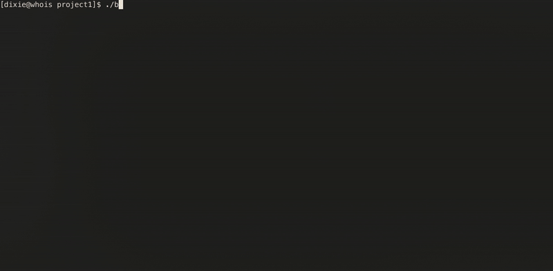

# Backgammon (board game)
The project was done as a part of my university study. It implements "backgammon" board game with all of its logic with additional features. It was made in pure C (see [Requirements](#Requirements)), along with `ncurses` library for visualisation purposes.

# Features
- Complete UI with menus, nickname prompts, dice drawing, colorful position visualisation and move highlighting, using `ncurses`
- Full backgammon logic:
    - Dice doubling
    - Only pawns that have legal moves are allowed (and highlighted)
    - Calculates multiple moves for the same pawn, also when dices are doubled (highlights it as well) 
    - Handles pawn capturing, bearing off from bar and "home"
- Two players mode
- Game saving and loading using binary files (one saved game at a time)

# Showcase

# Requirements
- It is **prohibited** to use object-oriented programming techniques (C++), in particular classes, inheritance mechanisms, polymorphism, overloading of functions and operators, etc. It is **allowed** to use data structures without methods (functions) inside the structures (C).
- It is **forbidden** to use global variables, except for variables of simple types (e.g. int, float, etc., without pointers) preceded by the const specifier.
- The use of the C++ (STL) template library is **prohibited**.
- The length limit (number of characters) of any function used (including main()) is 555 bytes. Comments and whitespaces are ignored.

# Credits
The author of the requirements is Michał M***. The full name is withheld for confidentiality reasons.
