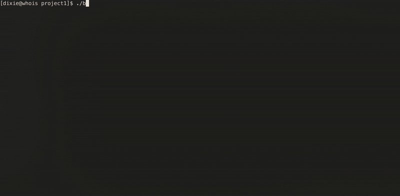

# Backgammon CLI
Implementation of Backgammon board game in C, along with `ncurses` library for visualisation.

# Features
- Complete UI with menus, nickname prompts, dice drawing, colorful position visualisation and move highlighting
- Full backgammon logic:
    - Handle doubled dices
    - Only legal moves are allowed and highlighted
    - Handle multiple moves for the same pawn and highlight it as well
    - Handle pawn capturing and bearing off from bar and home
- Two players mode
- Creating saves using binary format, with one saved game at a time

# Showcase

# Facts
- The length limit (number of characters) of any function used (including main()) is 555 bytes (excluding comments and whitespaces)

